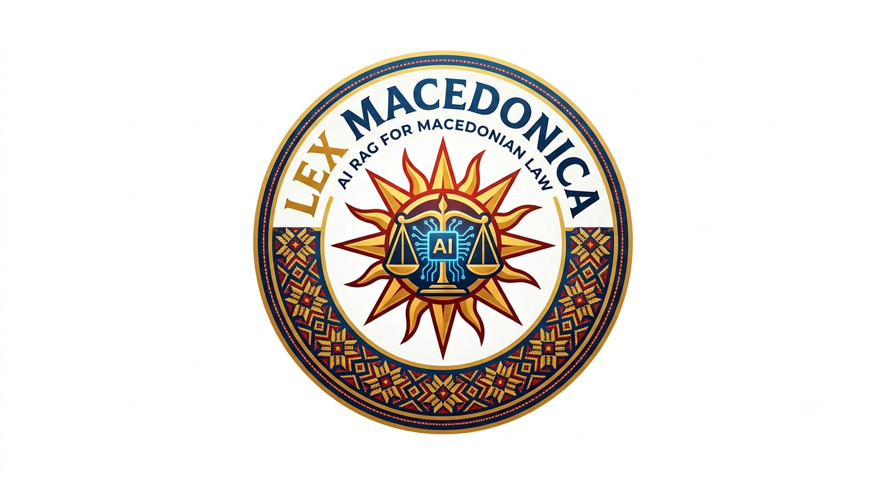

# LexMacedonica

<p align="center"></p>

АИ (RAG) асистент за македонско право. Четири интерфејси:

| Таб | Што прави |
|---|---|
| **Правен асистент** | Опишуваш ситуација → најверојатен исход + веројатност (%) пресметана од реални слични случаи, со цитирани предмети |
| **Симулација** | 4 АИ агенти (судија, двајца адвокати, наратор) го одигруваат твојот случај |
| **Адвокати** | Одговори засновани на закони со точни цитати по член + судска пракса; видливо резонирање |
| **Администрација** | Анонимизација на документи (имиња, ЕМБГ, адреси...) со објаснување |

Податоци: 370 одлуки за работни спорови (РО) од 13 основни судови (sud.mk) +
Закон за работните односи (2023) + Закон за облигационите односи, индексирани по член.

## Локално стартување

```bash
# 1. зависности (Python 3.12+)
python -m venv .venv
.venv\Scripts\pip install -r requirements.txt

# 2. клуч
copy .env.example .env        # и внеси го твојот OPENAI_API_KEY

# 3. податоци (еднократно; прескокни ако data/ веќе постои)
python -m app.scraper.run_scrape --prefix РО --limit 30   # симни одлуки
python -m app.ingest.build_index                          # индексирај случаи
python -m app.lawyer.download_laws                        # симни закони
python -m app.lawyer.build_laws                           # индексирај закони

# 4. старт
uvicorn main:app --reload
# -> http://127.0.0.1:8000
```

## Docker

```bash
docker compose up --build
# -> http://localhost:8000  (треба .env и веќе изграден data/ фолдер)
```

## Како работи (кратко)

Прашање → семантички кеш → **хибридно пребарување** (BM25 клучни зборови +
FAISS вектори, споени со Reciprocal Rank Fusion) → топ-3 извадоци како контекст →
**веројатност** = тежински удел на исходите кај топ-10 најслични случаи (реална
статистика, не измислена од моделот) → LLM одговор → **самопроверка** → ако
сличноста е премногу ниска: искрено „Не знам“.

Секој OpenAI повик се логира во `data/costs.json` (буџет < $20).

## Структура

```
app/scraper/   sud.mk скрејпер (WebSphere портал: сесии, base href, caseId)
app/ingest/    PDF → текст → исходи (regex) → SQLite → chunks → FAISS + BM25
app/rag/       хибриден retriever, веројатност, одговор+самопроверка, кеш
app/agents/    судска симулација (4 улоги, 6 реплики)
app/lawyer/    закони: симнување, индекс по член, law-first одговори
app/admin/     анонимизација (regex правила + АИ за имиња/адреси/фирми)
```
